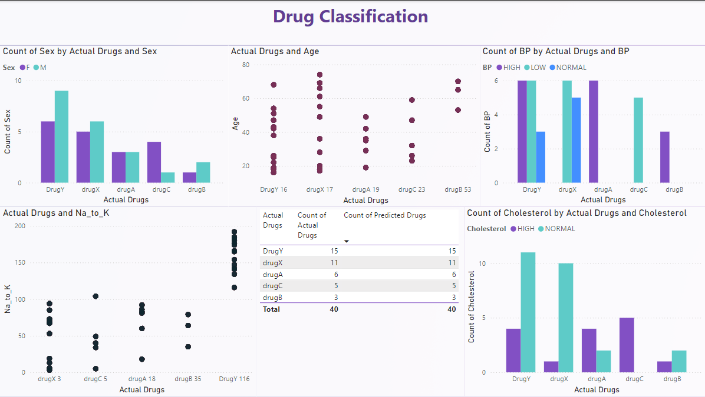

# Drug-Classification

## Overview
This project develops a machine learning model to classify drugs based on patient characteristics using Random Forest Classifier.

## Dataset Features
- Age
- Sex
- Blood Pressure (BP)
- Na to K Ratio
- Cholesterol

## Methodology
- Algorithm: Random Forest Classifier
- Preprocessing: Feature scaling, encoding
- Model Evaluation: Accuracy, Confusion Matrix, Classification Report

### Classification Metrics
| Class | Precision | Recall | F1-Score | Support |
|-------|-----------|--------|----------|---------|
| 0     | 1.00      | 1.00   | 1.00     | 15      |
| 1     | 1.00      | 1.00   | 1.00     | 6       |
| 2     | 1.00      | 1.00   | 1.00     | 3       |
| 3     | 1.00      | 0.80   | 0.89     | 5       |
| 4     | 0.92      | 1.00   | 0.96     | 11      |

### Overall Performance
- *Accuracy*: 97.50%
- *Macro Average Precision*: 0.98
- *Macro Average Recall*: 0.96
- *Macro Average F1-Score*: 0.97

## Power BI Dashboard

### Dashboard Insights
- Comprehensive visualization of drug classification parameters
- Interactive charts showing:
  - Age distribution
  - Blood Pressure correlations
  - Na to K Ratio analysis
  - Drug type comparisons
